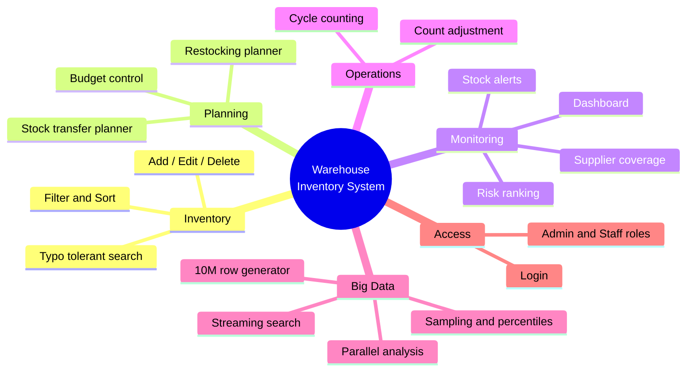
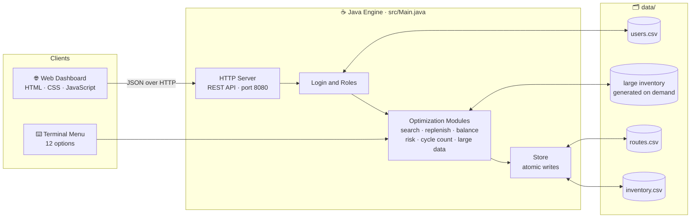
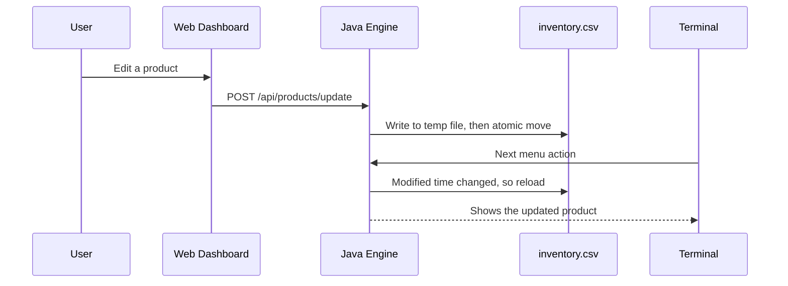
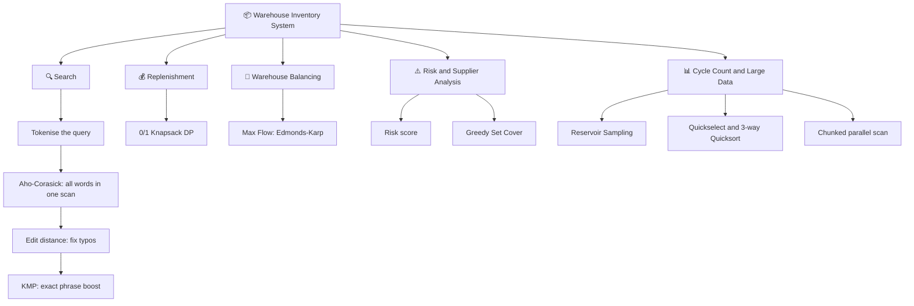
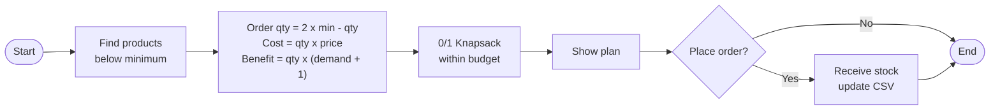
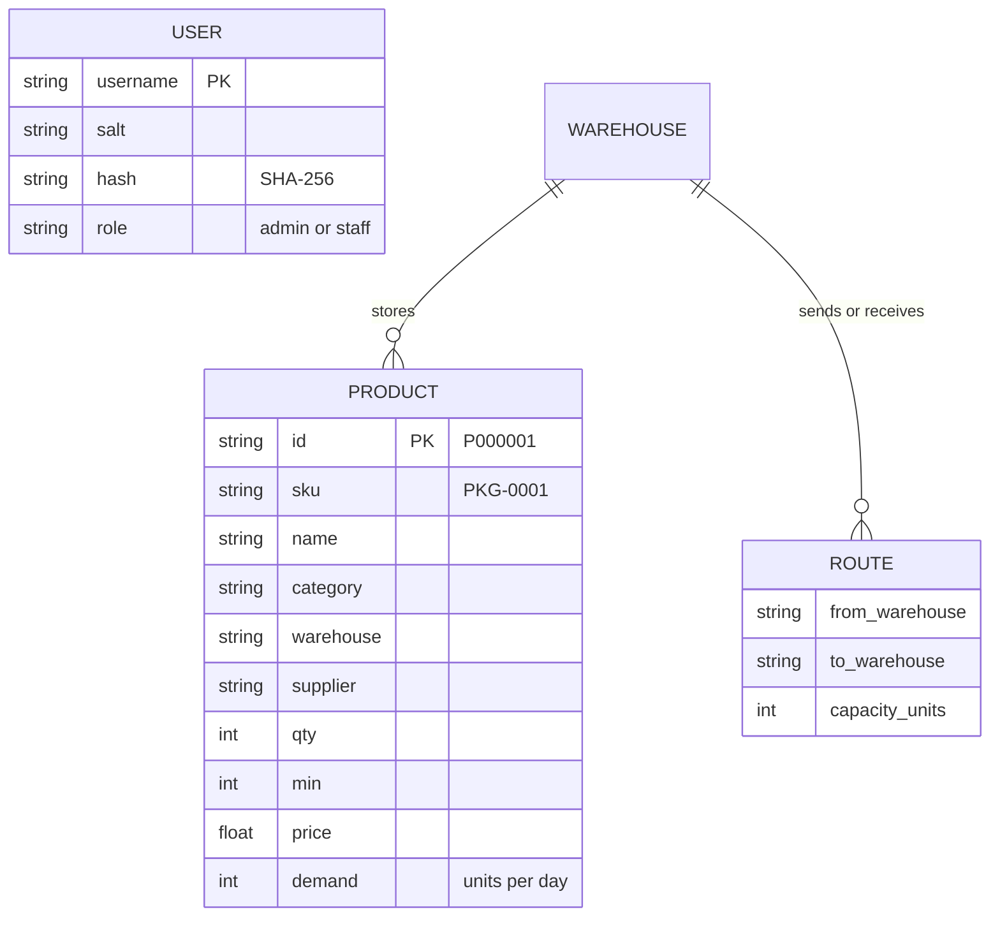
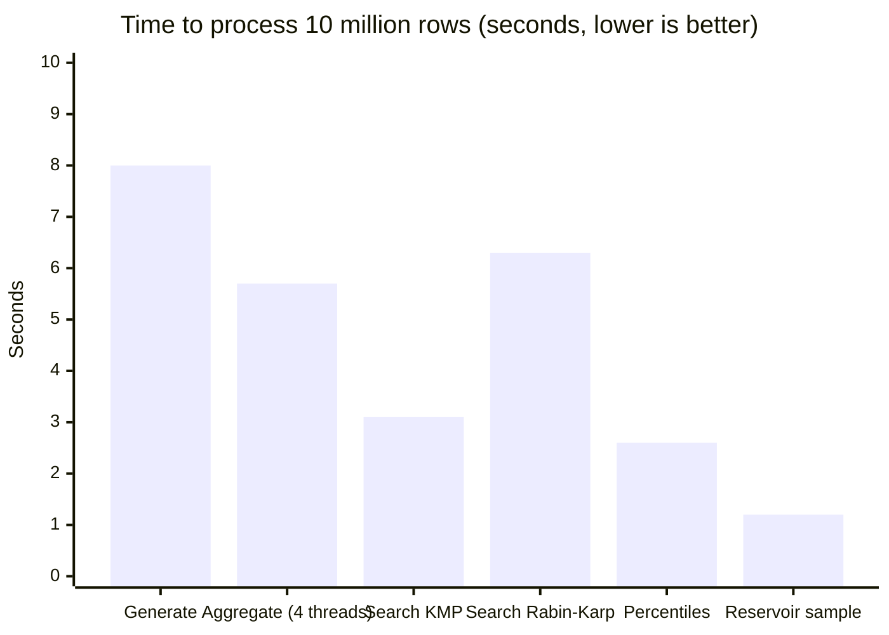
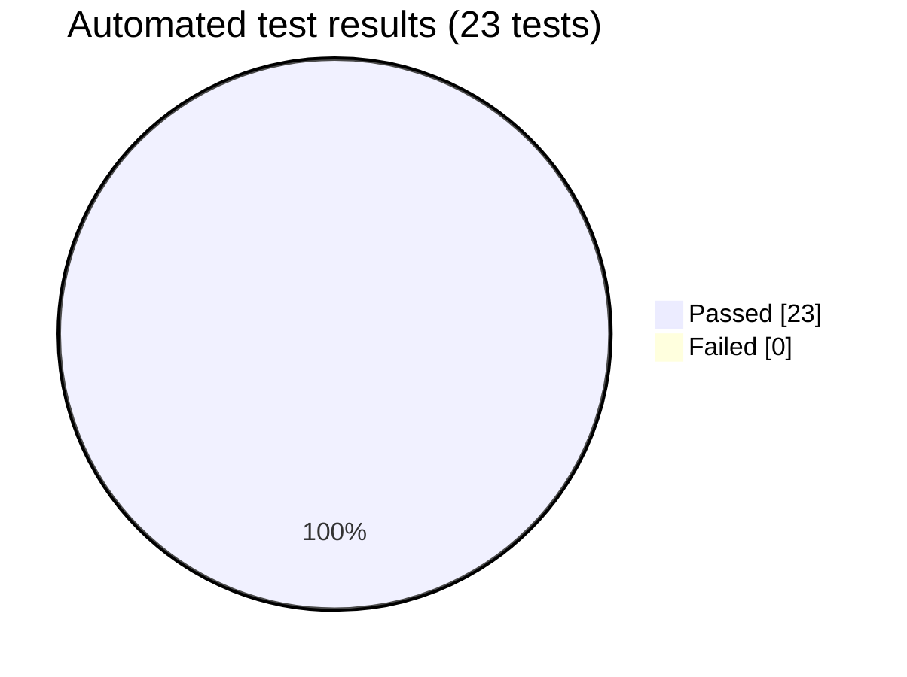

<div align="center">

#  Warehouse Inventory Management & Optimization System

**A Java-based warehouse operations platform with a web dashboard and a terminal interface, featuring intelligent search, replenishment optimization, warehouse balancing, risk analysis, cycle counting and large-scale (10 million row) inventory processing.**


**KLH · CSE · 2026-27 · DSA-3 · Section 6 · Team 17**

[Overview](#-overview) · [Features](#-features) · [Architecture](#-architecture) · [Modules](#-modules-and-algorithms) · [Quick Start](#-quick-start) · [Performance](#-performance) · [Team](#-team)

</div>

---

## 📖 Overview

Managing stock across many warehouses means answering questions quickly: *What do we have? What is running out? What should we order within our budget? Which warehouse should send stock to which?*

This project answers those questions with a single Java application that can be used from a **web dashboard** or a **terminal menu**. Both read and write the **same CSV files**, so a change made in one appears in the other straight away.

| | |
|:--|:--|
| 🏭 **Warehouses** | 5 (Mumbai, Delhi, Hyderabad, Chennai, Kolkata) |
| 📦 **Products in sample data** | 2,804 stock records across 6 categories |
| 🚚 **Transfer routes** | 20 warehouse-to-warehouse routes with capacities |
| 📈 **Scale tested** | 10,000,000 rows (~950 MB) |
| ✅ **Automated tests** | 23 / 23 passing |
| 👥 **Roles** | Admin and Staff |

---

## ✨ Features



| Area | What it does |
|---|---|
| **Dashboard** | Live summary of stock, alerts and priorities across all warehouses |
| **Inventory** | Add, edit, delete, filter and sort products, with a typo-tolerant search |
| **Restocking planner** | Picks the best set of items to reorder within a given budget |
| **Transfer planner** | Moves surplus stock from one warehouse to another where there is a shortage |
| **Risk analysis** | Scores every product from 0 to 100 and ranks products, warehouses and suppliers |
| **Cycle counting** | Selects a random sample to count, records the count and can adjust stock |
| **Data Center** | Generates and analyses a 10-million-row dataset using multiple threads |
| **Login & roles** | Admin can delete products; Staff cannot |

---

## 🏗️ Architecture

The web page and the terminal both talk to the same Java engine, which keeps everything in CSV files.



### How the website and terminal stay in sync



---

## 🧩 Modules and Algorithms

Each business feature is backed by a classic data-structures-and-algorithms technique.



| Module | Business purpose | Technique | Complexity / note |
|:--:|---|---|---|
| **1 + 2** | Find products, even with typos | Aho-Corasick, KMP, Z-algorithm, Rabin-Karp, suffix array + LCP | Multi-word search in one pass over the data |
| **3** | Spend a budget on the most valuable restock | Damerau edit distance, **0/1 Knapsack DP** | Never exceeds the budget |
| **4** | Move surplus to where it is needed | **Edmonds-Karp max flow** | O(V·E²); unmet shortage is reported |
| **5** | Rank risky products, warehouses and suppliers | Risk score + **greedy set cover** | H(d) approximation guarantee |
| **6** | Cycle counts and 10M-row analysis | Reservoir sampling, quickselect, parallel chunk scan | Streams the file, no full load in memory |

### Key definitions

| Term | Meaning |
|---|---|
| **Below minimum** | `qty < min` |
| **Surplus** | `qty > 2 × min` |
| **Order quantity** | `2 × min − qty` |
| **Risk score (0–100)** | `100 × (1 − daysOfCover / 21)`, plus 25 if below minimum; 100 if out of stock |
| **At risk** | Risk score ≥ 60 |

### Restocking decision flow



---

## 🗄️ Data Model



A SKU may exist in several warehouses. The pair **SKU + warehouse** is unique.

---

## 📁 Project Structure

```text
wms/
├── src/
│   ├── Main.java            # Java engine: server, algorithms, terminal menu, tests
│   └── web/
│       └── index.html       # Web dashboard (HTML, CSS, JavaScript)
├── data/
│   ├── inventory.csv        # 2,804 product records
│   ├── routes.csv           # 20 transfer routes with capacities
│   └── users.csv            # Users with salted password hashes
├── docs/
│   └── design.md            # Design notes and definitions
├── reports/
│   ├── test_report.md       # Automated test results
│   └── performance.md       # Large dataset timings
├── results/                 # Output files
├── run.bat                  # Run on Windows
├── run.sh                   # Run on Linux / macOS
└── README.md
```

---

## 🚀 Quick Start

**Requirements:** Java JDK 11 or newer. Nothing else, there are no external libraries.

### Windows

```bat
run.bat
```

### Linux / macOS

```bash
chmod +x run.sh
./run.sh
```

Then open **http://localhost:8080** in your browser.

### Demo logins

| Role | Username | Password | Can do |
|---|---|---|---|
| Admin | `admin` | `admin123` | Everything, including deleting products |
| Staff | `staff` | `staff123` | Everything except deleting products |

### Terminal commands

After compiling (`javac -d out src/Main.java`):

| Command | What it does |
|---|---|
| `java -cp out Main` | Opens the 12-option terminal menu (asks for the same login) |
| `java -cp out Main serve 8080` | Starts the web server on port 8080 |
| `java -cp out Main gen 10000000` | Generates a 10-million-row dataset |
| `java -cp out Main test` | Runs all tests and writes `reports/test_report.md` |

### Terminal menu

| # | Option | # | Option |
|:-:|---|:-:|---|
| 1 | Search products | 7 | Risk ranking |
| 2 | Add product | 8 | Cycle count |
| 3 | Edit product | 9 | Large data center |
| 4 | Delete product (admin) | 10 | String matching lab |
| 5 | Restocking planner | 11 | Dashboard summary |
| 6 | Transfer planner | 12 | Run tests |

---

## ⚡ Performance

Measured on 10,000,000 rows (~950 MB) on a single-core cloud VM. Multi-core laptops run the parallel steps faster.



| Operation | Time |
|---|---:|
| Generate dataset | 8 s |
| Parallel aggregation (4 threads) | 5.7 s (1.7 M rows/s) |
| Streaming search, KMP | 3.1 s |
| Streaming search, Rabin-Karp | 6.3 s |
| Percentiles via quickselect | 2.6 s |
| Reservoir sample | 1.2 s |

> The 10-million-row file is not stored in this repository because of its size. Generate it from the **Data Center** page or with `java -cp out Main gen 10000000`.

---

## ✅ Testing



The tests check each algorithm against a simple, obviously correct version: string search against naive search, knapsack against brute force, max flow against min cut, parallel against single-thread results, and the budget limit of the restocking plan. Full results are in [`reports/test_report.md`](wms/reports/test_report.md).

---

## 🔒 Data Safety

- **Atomic writes:** every save goes to a temporary file first and is then moved over the original, so a crash cannot leave a half-written file.
- **Always in sync:** every read checks the file's modified time, so the website and terminal see each other's changes.
- **Passwords:** stored as salted SHA-256 hashes, never as plain text.
- **Role checks:** deleting products is enforced as admin-only on the server, not just hidden in the page.

---

## 📚 Documentation

| Document | Description |
|---|---|
| [`docs/design.md`](wms/docs/design.md) | Storage format, definitions and how each module works |
| [`reports/test_report.md`](wms/reports/test_report.md) | Latest automated test run |
| [`reports/performance.md`](wms/reports/performance.md) | Large dataset benchmark |

---

## 👥 Team

**Team 17 · KLH · CSE · 2026-27 · DSA-3 · Section 6**

| Name | Student ID | GitHub |
|---|---|---|
| Mokshitha | 2520030396 | [@mokshithaputti8-web](https://github.com/mokshithaputti8-web) |
| Abhishiktha | 2520030185 | _@username_ |


---

<div align="center">

Built for the Data Structures and Algorithms course project, KLH.

</div>
